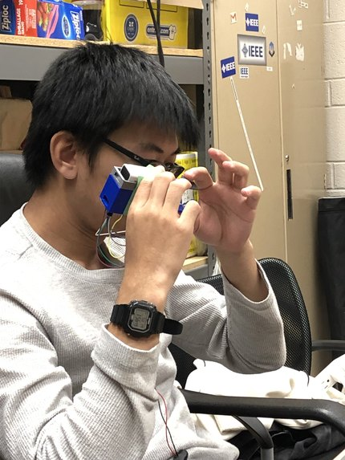
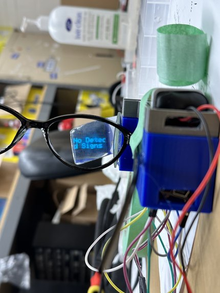
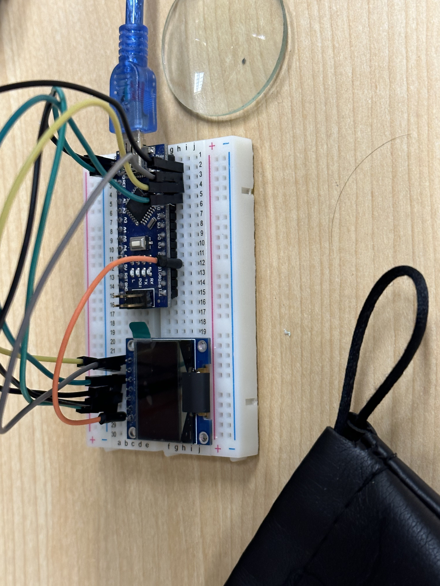
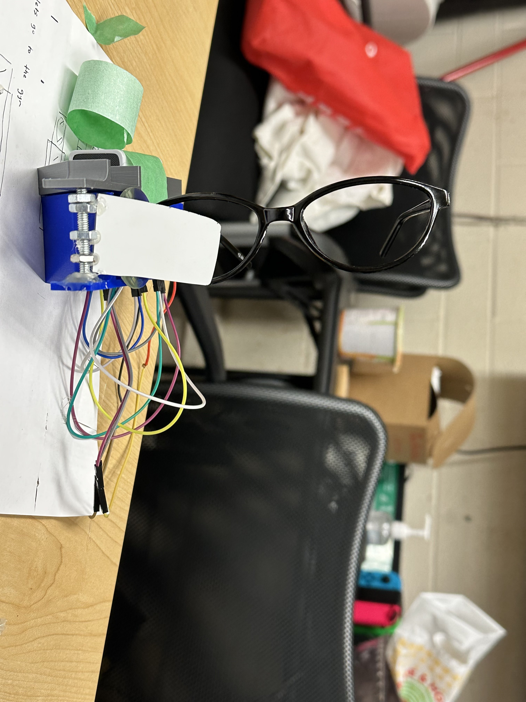

# Caption Glasses
The Caption Glasses provide captions displayed on glasses after detecting American Sign Language (ASL). The captions are instant and in real-time, allowing for effective translations into the English language for the glasses wearer.

# Built With
Arduino Nano, Arduino-C, Raspberry Pi 4B, Python, PyTorch (Neural Networks), MediaPipe, OpenCV2, Logitech WebCam, Prusa I3 3D printer, SolidWorks

# Technical Details
Caption Glasses is a hardware + computer vision oriented project, with a touch of professionalism through our 3D printed prototype!
## Hardware
The display unit of Caption Glasses consists of an Arduino Nano powering a SSD1306 0.96'' OLED display. It is possible to power the display unit with a 9-volt battery. The Arduino currently communicates with the computer vision processing unit using a Serial connection. In certain iterations of the project, the computer vision processing unit can be done on a Raspberry Pi 4B, powered by a power bank (those typically used for cellphones) and a Raspberry Pi Camera or Logitech Webcam. 
## Computer Vision Algorithm
The final version of the computer vision algorithm is as follows:
1. Using the MediaPipe Hand Landmarks library (by Google), 21 landmarks of a hand is located using an X,Y,Z coordinate system
2. The coordinates of each landmark is then fed into a custom trained Artificial Neural Network, built on PyTorch
3. The prediction is then communicated to the display unit using the Serial connection
This CV algorithm is (surprisingly) effective! The test data accuracy was 0.98 on the final model, trained with a batch size of 300, learning rate of 1e-2 and 29 epochs.
## Physical Modelling
Caption glasses looks like a small box, attached to the right side of your glasses. The OLED display is facing forward, and a mirror placed at 45 degrees to reflect the rays from the display through a 100mm lens. The rays are then projected onto a surface (in our final iteration, this was a second mirror) placed near your right eye. The modelling was completed on SolidWorks, and printed using a Prusa I3 3D printer over the span of 2 hours!

# Building Process
Caption Glasses began with prototyping hardware and design, starting off by programming a SSD1306 OLED 0.96'' display with an Arduino Nano. The glasses attachment is a 3D printed Solidworks design from a Prusa I3 3D printer and compiled with all key hardware components. On the software side, we loaded computer vision models onto a Raspberry Pi4. Although we were successful in loading a basic model that looks at generic object recognition, we were unable to find an ASL gesture recognition model that was compact enough to fit on the RPi. To circumvent this problem, we used MediaPipe Hand Recognition models which marked out 21 landmarks of the human hand (including wrist, fingertips, knuckles, etc.). We then created a custom Artificial Neural Network that takes the position of these landmarks and determines what letter we are trying to sign. The machine-learning model is trained with thousands of our own data points.

# Roadblocks and Issues
## Incorrect Operating System for the Raspberry Pi
Due to the OS being for the Raspberry Pi 4B being 32-bit instead of 64-bit, we were unable to load key libraries onto the Raspberry Pi that were necessary to run our computer vision algorithm. The most problematic libraries were: PyTorch, NumPy and MediaPipe. These issues forced the team to move to using a laptop instead for the computer vision processing unit.
## Training a (truly) effective model
Prior to reaching the MediaPipe approach, we tried to train our own image classification network using Teachable Machine (by Google). However, this approach produced a network with 0.6 test accuracy, which was unacceptable to our project's goals. 

# Next Steps
Here are some key items (in no particular order) that we want to implement in further iterations of this project:
## Caption glasses mobile 🤳
The current design uses cable connections to a laptop, or a connection to a Raspberry Pi. The cable connection completely immobilizes the user, and the Raspberry Pi makes the device significantly unwearable due to its weight. The following two appraoches show some promise in terms of turning Caption Glasses into a more independent device.
- Using an ESP32i, we would be able to control the display and conduct image processing in one go. Given the compact size of an ESP32, it would make Caption Glasses truly mobile.
- Using a HC06 Bluetooth Module, we would be able to communicate between the image processing unit (laptop) and the display unit remotely. While this approach is less standalone than the former, it would be a much safer option since ESP32i's may not have support for the key libraries that we need to run the computer vision model (MediaPipe, PyTorch)
## Displaying Comprehensive Words
The current design simply streams all the characters onto the OLED display, so users get somewhat confused (understandably) after the device fills up with characters that are in a seemingly random sequence. However, using a NLP processor (possibly BERT or a customly-trained processor), we would be able to strategically deploy spaces and other gramatical tools to ensure that the output makes syntatic sense.
## Controllable Caption Glasses
The current design does only two things, capture the character spelt by the hand closest to you and streams it onto the OLED display for the user to see. A tool that would greatly improve the user's experience is to come up with more controls for the user to be able to control the font size of the text, the speed at which the signing person can comfortably sign at (currently, this rate is capped at 1 character per second to make sure there is no noise being captured). To accomplish this, we can incorporate more gestures to the computer vision model (such as up, down and other gestures that imitate the experience of using a modern smartphone).
## AR Caption Glasses
Currently, the display hinders the user's view due to it not being transparent. Further iterations will seek to mitigate this issue by using plexiglass or another transparent material for the projection surface. 

